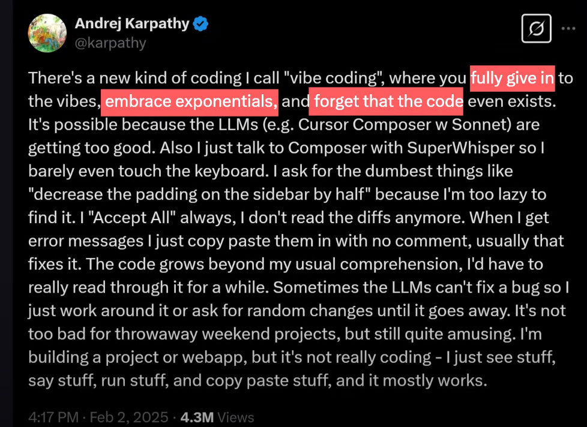
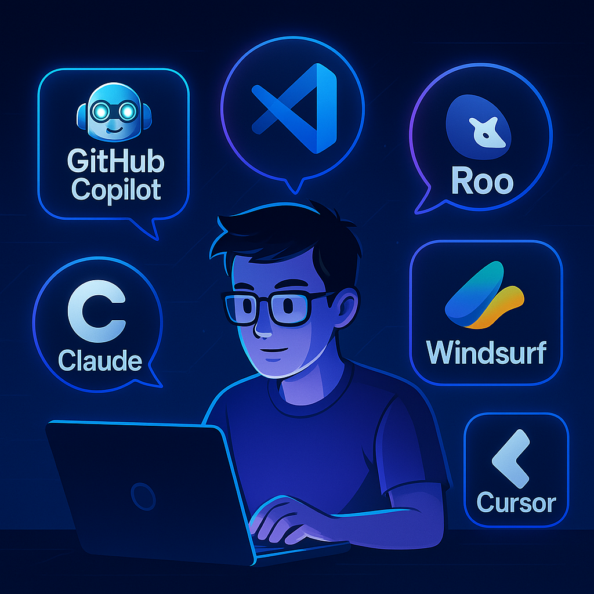
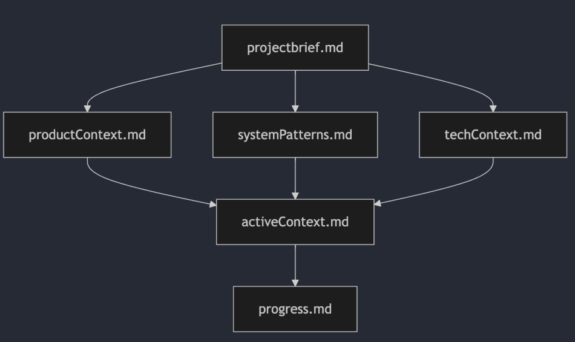
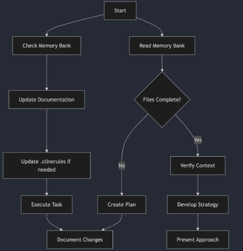

<!-- _class: lead -->
# Structured Vibe Coding
## Harnessing AI for Development

---

## What is Vibe Coding?

*   **Concept:** Leverage AI (LLMs), focus on rapid iteration & results over granular code details. (coined by Andrej Karpathy).
*   **The Promise:** Accelerates development, great for PoCs, prototypes, and enabling non-coders to visualize concepts.
*   **The Consideration:** Without structure, can lead to challenges in maintainability, security, and production readiness.
    *   *Example: Risks increase without oversight (e.g., the hacked SAS product).*
*   **Key Takeaway:** Powerful for exploration; structure is key for reliable, production-ready applications.

---

## Coding vs. Programming

*   **Coding:** Translating logic into instructions (Automatable by AI).
*   **Programming:** Broader skill – art & science (Creativity, Experience, Understanding Why/How). Requires guiding the AI.
*   **Your Role Shifts:** You become the **Programmer** directing the AI **Coder**.

---

<!-- _class: invert -->
# Responsible Vibing: Core Principles

Structure and Flow are key to harnessing AI power safely.

---

## Principle 1: Be the AI's Product Manager

*   **Your Role:** Direct the AI with clear, specific goals.
*   **Break Down Complexity:** Small, actionable steps are better than large, vague requests.
*   **Provide Context:** Feed the AI necessary info (goals, docs, code snippets).
*   **Be Specific:** Detail technologies, libraries, desired output. Don't leave the AI guessing.
*   **Goal:** Make the AI's job easy -> Better, more deterministic output.

---

## Principle 2: Choose Your Stack Wisely

*   **Why?** LLMs excel with well-documented, popular technologies (React, Vue, Python, JS, etc.).
*   **Benefit:** More predictable AI output, easier debugging.
*   **Recommendation:** Start with common stacks unless you have deep expertise elsewhere. 
*   **What if I dont know** Ask the Agent to recomamnd one

---

## Principle 3: Master Git (Your Safety Net!)

*   **Why?** AI *will* make mistakes, overwrite code, or go off track.
*   **The Solution:** Disciplined Version Control.
    *   Commit frequently after verifying AI changes.
    *   Write meaningful commit messages (or use AI commit tools).
    *   Use branches for features/experiments.
*   **Benefit:** Always revert to a working state. **Non-negotiable.**
*   **What if I dont know** Ask the Agent to recomamnd one

---

## Some more advices (for Effective AI Coding)

### Interaction Style ( Between you and the Agent)
*    **Use High-Level Docs:** Provide context via `planning.md`, `task.md`, etc.
*    **Start Fresh Conversations Often:** Avoid LLM degradation.
*    **One Thing at a Time:** Request one feature/change per prompt.

### Leave it to the Guiding rules ( follow the setup guides)
*    **Keep Code Files Short:** Aim for < 500 lines.
*    **Write Tests!** Crucial for consistency & quality.
*    **Docs & Comments As You Go:** Helps you and the AI.

### Just in case you consider make it external
*    **Handle Security Yourself:** Manage keys, secrets, auth logic manually.

---

<!-- _class: invert -->
# Introducing Coding Agents

AI Coding Agents for VS Code & Cursor

---

## Getting Started with Cline/Roo

*   **Installation (VS Code):**
    *   Search Marketplace: `rooveterinaryinc.roo-cline`
    *   Command Line: `code --install-extension rooveterinaryinc.roo-cline`
*   **Installation (Cursor):** Often built-in or via similar extension mechanisms.
*   **Setup:** Reload IDE, configure API key & preferred model via extension settings.
*   **Key Features:** Chat interface, file edits, terminal execution, multi-step tasks, Plan & Act modes ( Roo has more and are customizable)

---

# The Structured Workflow (Example: Cline/Roo)

*(Note: While examples use Cline/Roo, the core concepts – Plan, Setup Context, Execute, Iterate, Test, Document – apply to **any** AI coding assistant/IDE like Copilot, Cursor, etc.).*

**Know where you want to go:** DEfine you project ( Write a prd / product brief ).
**Planning:** Define the project foundation (i.e, Memory Bank).
**Setup:** Configure rules and context mechanisms (e.g., Workspace Rules).
**Execution:** Use Plan/Act modes, leverage models & tools (MCP).
**Iteration:** Refine with Git and Testing.
**Deployment:** Package the application.

---

## Workflow Step 1 (Know Where you are heading):

*   **Goal:** Establish high-level direction *before* coding.
*   **Action:** Create initial **ProductBrief.md** file:
    *   Ask for a `projectbrief.md`: High-level goals.
    *   Add as you know tech info: `Stack, Tools, Constraints`.
    *   Add thought on planning  (Optional): Initial mile stones / tasks.
*   *(Can use AI chatbots like Claude/ChatGPT for initial drafting) - The more time spent the better results*

---
## Workflow Step 2: Planning (Memory Bank Foundation)

*   **Goal:** Establish high-level direction *before* coding.
*   **Action:** Create initial **Memory Bank** files:
    *   `projectbrief.md`: High-level goals.
    *   `productContext.md`: Why, What, How.
    *   `techContext.md`: Stack, Tools, Constraints.
    *   `task.md` (Optional): Initial task breakdown.
*   *(Can use AI chatbots like Claude/ChatGPT for initial drafting)*

---

## Workflow Step 3: Setup (Context is King!)

*   **Challenge:** LLMs need persistent context beyond single prompts.
*   **Solution:** Agent ( Cline/Roo / Vscode)  Memory Bank + Global/Workspace Rules.

---

### Setup: Global / Workspace Rules

*   **Purpose:** Provide high-level, persistent instructions (like system prompts).
*   **Content:** How to use Memory Bank, code constraints (e.g., < 500 lines), testing rules, style guides, security reminders.
*   **Setup (IDE Specific):**
    *   **Cline/Windsurf:** Use "Manage Memories" -> Workspace Rules.
    *   **Cursor:** Configure via relevant settings or custom instruction panels.
    *   **VS Code (Generic):** Depends on the specific AI extension; look for custom prompt/instruction settings.
*   **Benefit:** Avoid repeating instructions in every prompt.

---
### Setup: Agent Memory Bank Structure

*   **Purpose:** Persistently stores project context (goals, decisions, tech, progress) for the AI.
*   **Structure:** Hierarchy of Markdown files.
*      - projectbrief.md:  The foundation document that shapes everything else
*      - productContext.md: The business and user perspective
*      - systemPatterns.md: Technical architecture and decisions
*      - activeContext.md: Current state of development
*      - progress.md: Project status and tracking

---

### Memory Bank Workflow (How the agent act)

The Memory Bank prompt force the agent to operates on a continuous cycle of read, verify, execute, and update:

#### Initial Setup - When starting a new project:
* Agent creates the memory-bank/ directory
*   Initializes all required files
*   Requests necessary information from users
*   Establishes baseline documentation

#### During Development
* Before any work:
*   Read all Memory Bank files
*   Verify context is complete

---

### Memory Bank Workflow (How the agent act)

#### During Development(cont)
* During work:
*   Follow established patterns
*   Track changes and decisions
*   Monitor context window usage

*After significant changes:
*   Update relevant documentation
*   Ensure consistency across files
*   Prepare for potential context resets

---
### Guiding AI With Visual / Flow

---

### Memory Bank Commands

*   `initiate memory bank`: Initialzie the bank and update docuemtns based on the product brief (`productbrief.md`/ existing code.
*   `update memory bank`: Summarize and save the current chat context to relevant Memory Bank files (esp. `activeContext.md`, `progress.md`). Use when context window is filling up (~70-80%).
*   `clear memory bank`: Reset stored context (use cautiously).
*   `FYCI` (Follow Your Custom Instructions): Explicitly tell the agent to load Memory Bank context (useful at start of new sessions).

---

## Memory Bank: Further Reading

*   **Blog Post:** [Cline Memory vs Cursor Memory: Which is Better?](https://apidog.com/blog/cline-memory-cursor/)
*   **Official Docs:** [Cline Memory Bank](https://docs.cline.bot/improving-your-prompting-skills/cline-memory-bank)
*   **Template:** [Memory Bank Custom Instructions (GitHub)](https://github.com/cline/cline/blob/main/docs/prompting/custom%20instructions%20library/cline-memory-bank.md)

---

## Workflow Step 4: Execution

*   **Plan/Act Cycle:**
    *   **Plan Mode:** High-level design, outlining steps.
    *   **Act Mode:** Code execution based on the plan.
    *   Iterate: **Plan -> Act -> Review -> Refine**.
*   **Model Selection Strategy:** Choose the right tool for the task.

---

### Model Selection Strategy

| Model           | Best For             | Context    | Strengths                                          |
|-----------------|----------------------|------------|----------------------------------------------------|
| **Model 01**      | Planning/Architecture| Medium     | Deep reasoning, design, complex solutions          |
| **Claude 3.5**    | Everyday Coding      | Large      | General tasks, speed/quality balance               |
| **Claude 3.7**    | Heavy Lifting        | Very Large | Extended output, complex tasks, plan revisions     |
| **Gemini 2.5 Pro**| Large Codebases      | Mega Context  | Complex tasks, long context, deep understanding    |

*Switch models based on the current phase (planning vs. coding vs. refactoring). Not every agent has access to all models*

---

### Advance Topic: Extending Capabilities: MCP Servers

*   **MCP (Model Context Protocol):** Gives AI access to external tools/actions (if supported by your tool).
*   **Core Servers (Examples):**
    *   **File System:** Interact with files outside the project.
    *   **Web Search (Brave):** Pull documentation, examples.
    *   **Git:** Manage version control via prompts.
*   *(Setup involves configuring MCP server connections)*

---

## Workflow Step 5: Iteration (Refine & Test)

*   **One Change at a Time:** Avoid overwhelming the LLM.
*   **Git is Your Friend:** Commit working changes frequently. Revert if AI breaks things.
*   **Testing:**
    *   Ask AI to write unit tests (Pytest, Jest, etc.).
    *   Use mocks for external dependencies (databases, APIs).
    *   Test success, error, and edge cases.

---

## Workflow Step 6: Deployment

*   Use AI to help package your application.
*   **Docker:** LLMs are generally good at creating Dockerfiles.
*   **Prompt Example:** "Write a Dockerfile for this Python app using `requirements.txt`. Provide build commands."
*   AI can also help generate deployment sections for your `README.md`.

---

## Optimization & Troubleshooting

*   **Custom Modes:** Define modes for specific, repeated tasks (e.g., "Tester", "Documenter").
*   **Efficiency Tweaks:** Limit terminal output, adjust delays, use checkpoints.
*   **Context Overflow:** Use `update memory bank` proactively.
*   **Instruction Adherence:** Reiterate critical points if AI drifts.
*   **Glitches:** Reload IDE, keep extensions updated.

---

## Tools for the (Structured) Vibe

*   **AI IDEs / Editors:**
    *   VS Code + Cline / GitHub Copilot (AZ's approved IDE)
    *   Cursor
*   **Context Management:**
    *   Cline Memory Bank (or similar structured documentation)
*   **Version Control:**
    *   Git (Essential!)
    *   AI Commit Tools (clicommit, Copilot suggestions)
*   **UI Generation (Optional):** Vercel v0, etc.

---

<!-- _class: invert -->
# Conclusion: Vibe Smart, Not Hard

*   **Vibe Coding is Powerful:** AI significantly accelerates development, especially for exploration, PoCs, and visualizing concepts.
*   **Structure Enables Reliability:** Process & context (Memory Bank, Git, Planning) turn rapid iteration into dependable results.
*   **You are the Programmer/Guide:** Direct the AI, structure the process, and validate the output.
*   **Master the Flow:** Use the right tools, models, and workflow for your specific goals (exploration vs. production).

**Go forth and vibe effectively!**

--

## Advanced Topics

*   **Documentation beyond Memory Bank**
    * AZ Templates
*   **Agents Personas**
    *   Roo Code : Ask , Architect , Code , Test
    *   Customized: UX , Research ..
*   **MCP Servers:**
    *   Cline Memory Bank (or similar structured documentation)
*   **UI Generation (Optional):** Vercel v0, etc.
